# ComfyUI-Tattoo-Workflow

## Project Overview 
The goal of this project is to create a ComfyUI workflow that generate a tattoo onto a person. 

- The folder input images contain the images used as the base image ( a photo of a person).
- The output images folder showcases  the images created througout this project. 
- eden_tatoo_v1 is an early version 
- tattoo_crop is the latest version 

## Methods
1. ** Input image prepartions**
    - Input: image of a person 
    - Manually select a masked area where the tattoo will be applied.
        <td>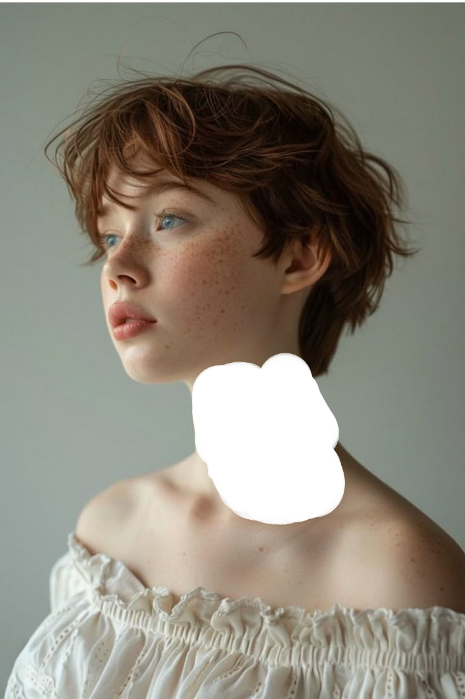</td>
    - Crop the image around the masked area.
        <td>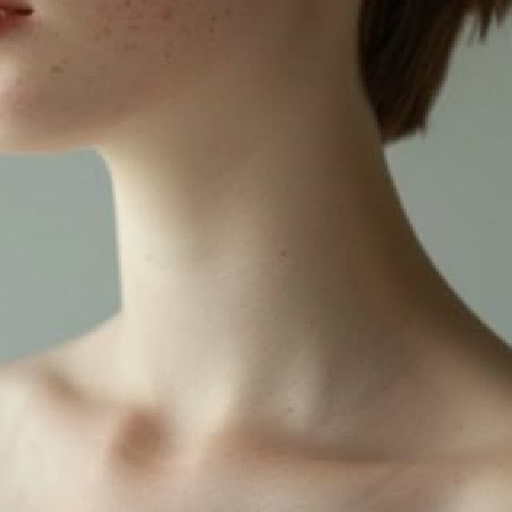</td>
        
        This image with the mask will be the one used. The crop ensures better resolution and detail since model output strongly depends on input resolution.
    - upscale the images - to match model input requirements and ensure better generation quality.
2. ** Models used **
    - Base: Juggernaut-X-RunDiffusion-NSFW
    - Loras : sleeve_tattoo_v3.safetensors, SGShkurushka_198800,Tattoos
    
    Using different loras add images of tattoos to the model and can change the style that is generated, for example one lora wont generate word tattoos while another will:
    <td>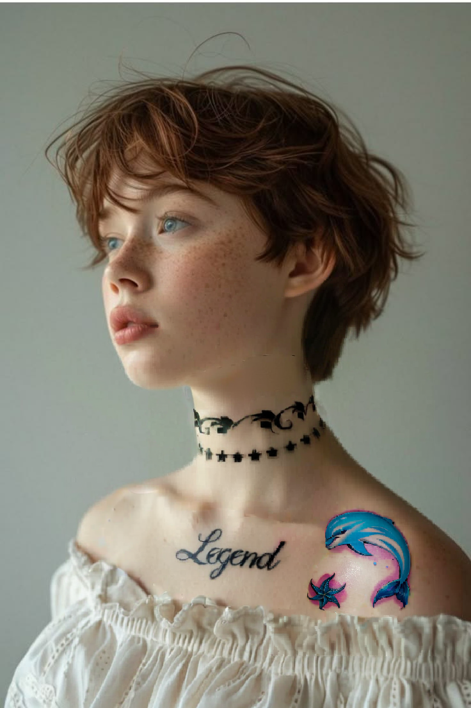</td>
3. ** Generating tattoo **
    - Prompts - positive + negative
    - Lora that are trained on tattoo help achive different styles
    - Control net , depthanything preprocessor help guide the placement of the tattoo and blend it onto the body and match the skin.
    <td>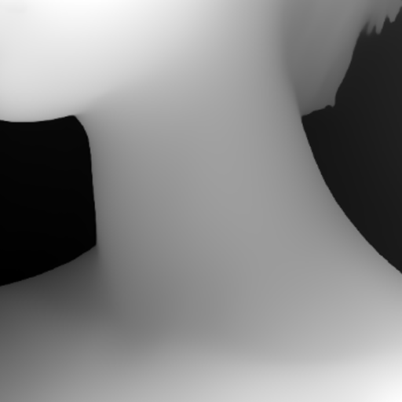</td>
    - Using mask inpainting is used to generate the tattoo on the selected area.

## Summary
This workflow uses a **crop-and-stitch inpainting strategy** to generate detailed and realistic tattoos:
- Cropping improves detail in the tattoo region.
- The tattoo is generated on the masked area of the cropped image.
- The result is stitched back for a clean, complete output.
### Examples

<table>
  <tr>
    <td>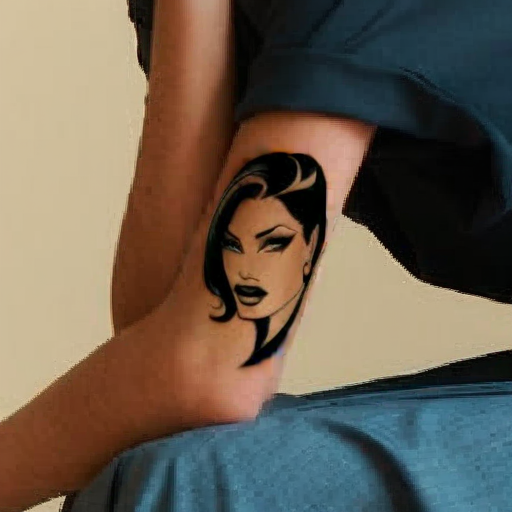</td>
    <td></td>
    <td>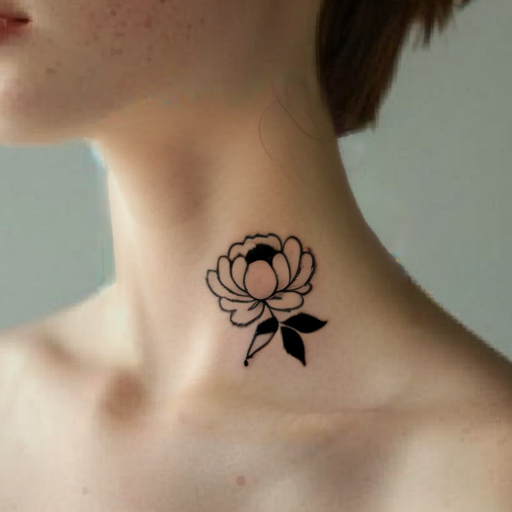</td>
  </tr>
</table>

Throughout the project, I experimented with different:
- LoRA combinations
- KSampler settings
- Style weights

<table>
  <tr>
    <td>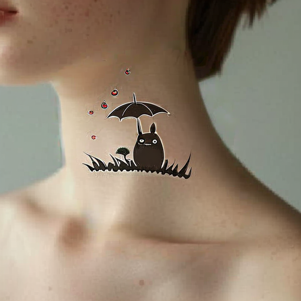</td>
    <td>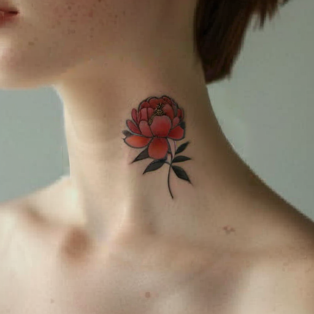</td>
    <td>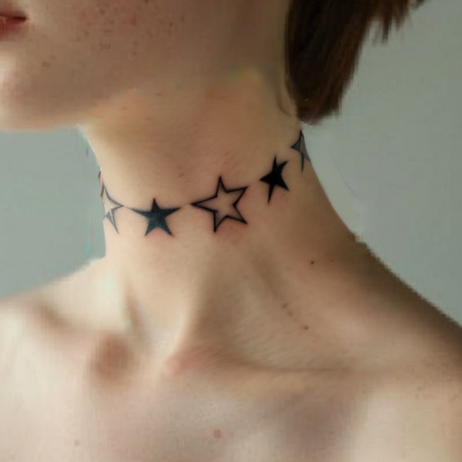</td>
    <td>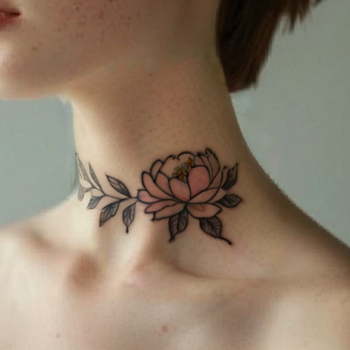</td>
  </tr>
</table>

## Latest results 

<table>
  <tr>
    <td></td>
    <td>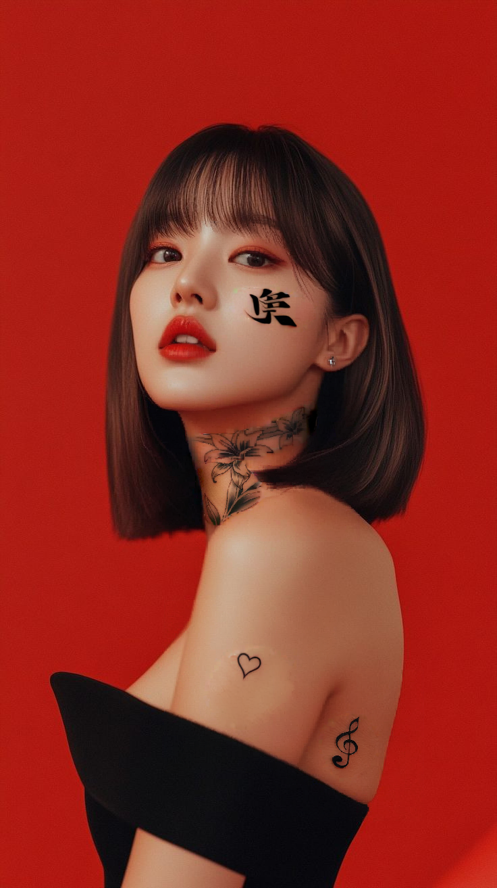</td>
  </tr>
</table>

<table>
  <tr>
    <td>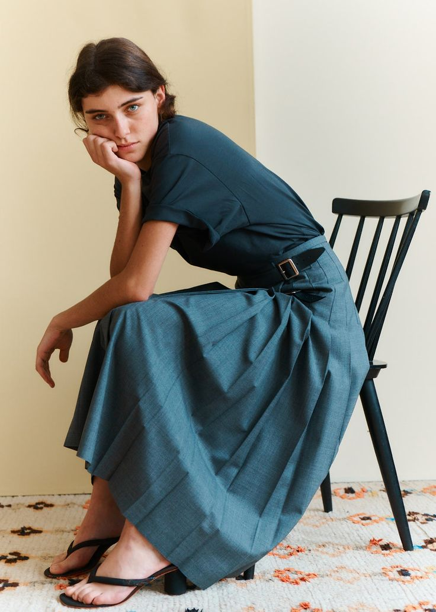</td>
    <td></td>
  </tr>
</table>

<table>
  <tr>
    <td>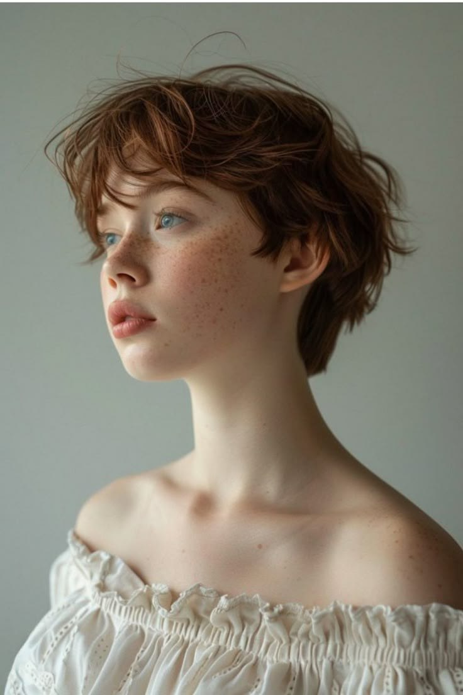</td>
    <td></td>
  </tr>
</table>

<table>
  <tr>
    <td>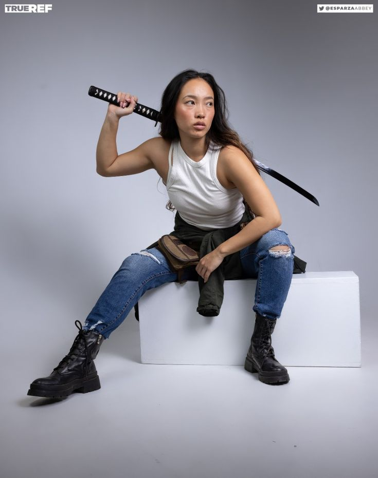</td>
    <td>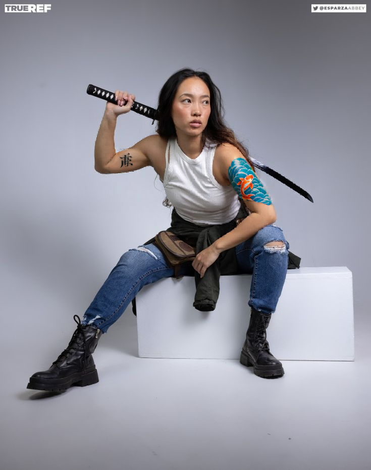</td>
  </tr>
</table>

