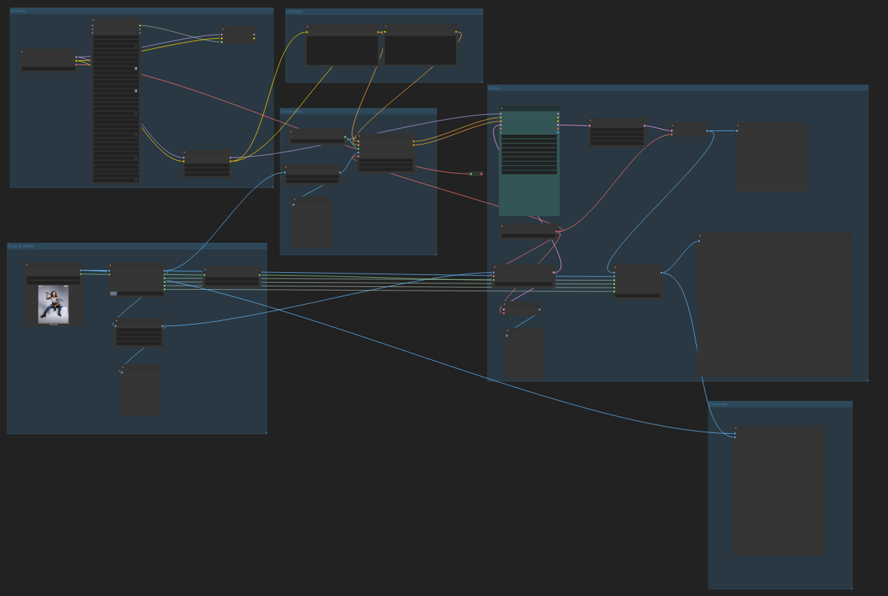
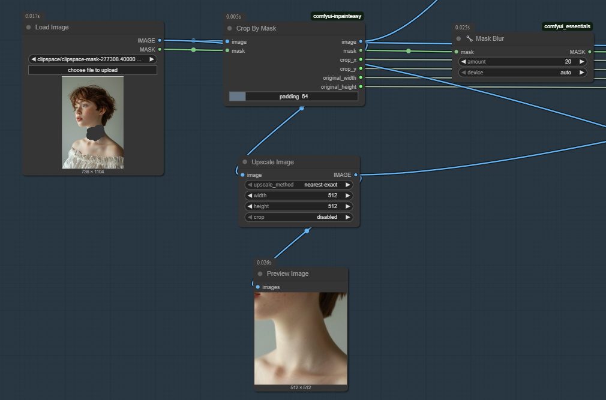
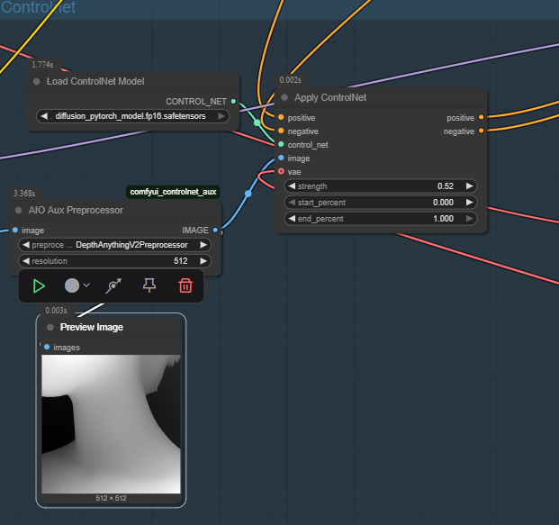
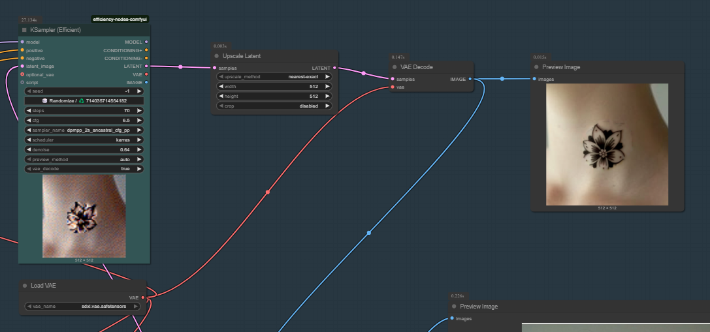
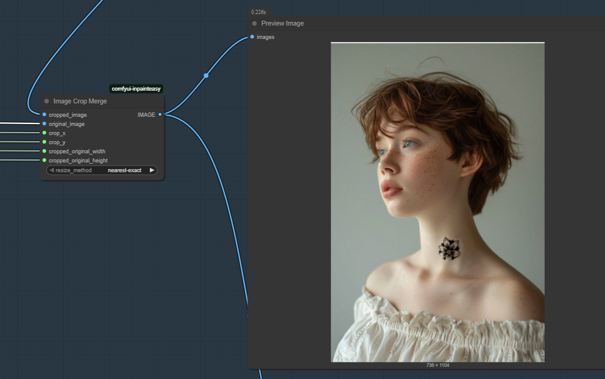
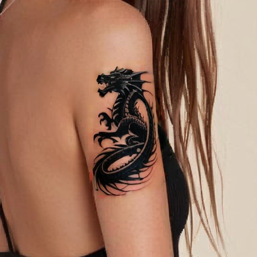
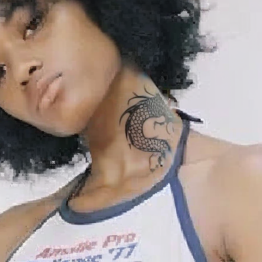
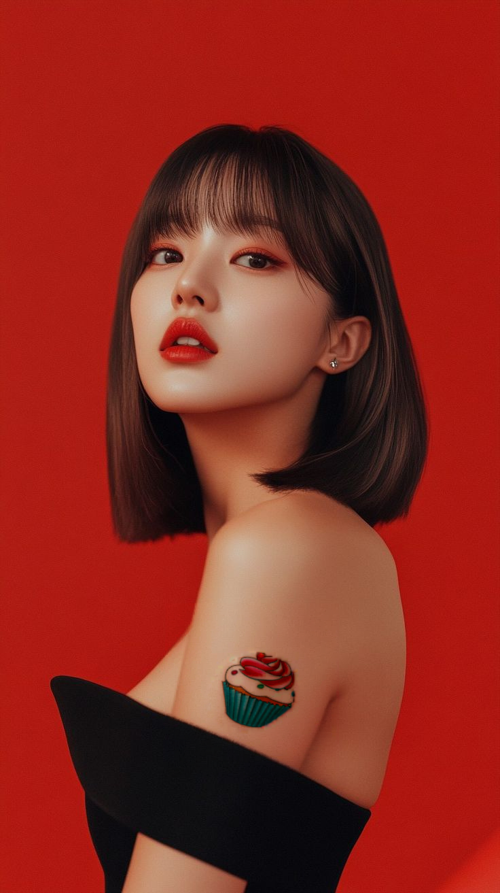
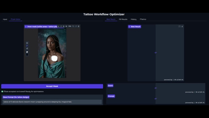

# ComfyUI-Tattoo-Workflow
Project by Eden Taub

## Introduction

This project presents an advanced image-generation workflow for creating realistic tattoos on images of people, using ComfyUI along with inpainting, optimization techniques, and a user-friendly Gradio interface.

The system allows the user to select tattoo placement and automatically generates optimized results based on model guidance and user input.

### Goals 
The primary goals of the project were:
- To build a complete workflow that can realistically place tattoos on human skin.
- To allow user interaction for tattoo placement.
- To optimize generation quality and automation using Python.

These goals were successfully achieved by designing a custom ComfyUI workflow, implementing a Gradio-based GUI, and developing a Python-based optimization pipeline.

## Project Components

- ComfyUI workflow : tattoo_crop.jason
- ComfyUI custom node : load_mask.py
- GUI : tattoo_gradio.py
- Optimizer : tattoo_optimizer.py

## Workflow Design in ComfyUI

<td></td>

The first major step was creating a detailed workflow that produces tattoos naturally embedded into human skin—without breaking realism. The workflow includes the following stages:

1. **Input image preparations**
    <td></td>

    - Input : Image of a person 
    - The user draws a mask over the area where the tattoo should be placed. 

      <td></td>
    
    - The image is automatically cropped around the mask to focus on the region of interest, improving resolution and detail.

      <td></td>
    
    - Images are upscaled as needed to match model input requirement
    - Mask Node: when using the ComfyUI as backend i created a custom node to allow masks inputs from outside the ComfyUI editor.

2. **Models used**
    - Base: Juggernaut-X-RunDiffusion-NSFW
    - LoRA : real-02.safetensors, SDXL-tattoo-Lora.safetensors , TheAlly_Tattoo_Helper..safetensors, ginavalentina-01.safetensors
    
      After testing several models, I selected Juggernaut-X due to its strong inpainting capabilities and consistent output quality. 

      LoRA (Low-Rank Adaptation) models were used to inject tattoo-specific styles and features into the base model. These lightweight fine-tuning models enhance the tattoo generation process without needing to retrain the entire model.

      By switching between different LoRA models, the system can generate tattoos in a wide range of artistic styles. The example below demonstrates how the tattoo's appearance varies depending on which LoRA was used:
      
      <td></td>

3. **Generating tattoo**

    <table>
    <tr>
        <td></td>
        <td></td>
        <td></td>
    </tr>
    </table>

      - Prompts :  Both positive and negative prompts guide the tattoo’s style and content. Users must include the word “tattoo” in the prompt. Prompts can be simple (e.g., “flower tattoo”) or detailed (e.g., “a delicate floral tattoo design, fine-line style, black and grey”). 
      - LoRA models are used to influence the tattoo’s appearance. 
      - ControlNet and depth preprocessors help guide tattoo placement and blending, ensuring the tattoo matches the body’s contours  and skin tone.
      
          <td></td>
      - Mask inpainting is used to generate the tattoo only within the selected area.

4. **Post Processing**

- The generated tattoo region is stitched back into the original image for a seamless result.

### Summary
This workflow uses a **crop-and-stitch inpainting strategy** to generate detailed and realistic tattoos:
- Cropping improves detail in the tattoo region.
- The tattoo is generated on the masked area of the cropped image.
- The result is stitched back for a clean, complete output.
### Examples

<table>
  <tr>
    <td></td>
    <td></td>
    <td></td>
  </tr>
</table>

Throughout the project, I experimented with different:
- LoRA combinations
- KSampler settings
- Style weights

<table>
  <tr>
    <td></td>
    <td></td>
    <td></td>
    <td></td>
    <td></td>
    <td></td>
  </tr>
</table>

<table>
    <tr>
        <td></td>
        <td></td>
        <td></td>
  </tr>
</table>

## Latest results 

<table>
  <tr>
    <td></td>
    <td></td>
  </tr>
</table>

<table>
  <tr>
    <td></td>
    <td></td>
  </tr>
</table>

<table>
  <tr>
    <td></td>
    <td></td>
  </tr>
</table>

<table>
  <tr>
    <td></td>
    <td></td>
  </tr>
</table>

## Optimization Process
To refine outputs and automate quality improvements, a Python-based optimizer was developed.
### Key Features 
 - **Parameter Sampling:**
    The optimizer samples different parameters (e.g., LoRA weights, denoise values, samplers, schedulers) within empirically determined effective ranges
 - **Prompt Variations:**
    Multiple prompt variations are generated to explore stylistic diversity.
 - **Scoring and Selection:**
    Each generated image is evaluated using a combination of metrics:
    - CLIP Similarity: Measures how well the generated tattoo matches the prompt, with the prompt phrased as “a person with a tattoo of [design] ” for better alignment and the orignal prompt is mesured as well.
    - Image Quality Metrics: Brightness, contrast, sharpness, edge quality, and noise level are considered, with weights adjusted to focus on the tattoo region.
    - Weighting Strategy: Weights are adjusted to focus on the tattoo region and visual clarity, with semantic similarity prioritized.

### Gradio User Interface

A custom Gradio UI makes the workflow accessible and interactive:

- **Image Upload:**
  Users can upload a base image and immediately see it in the interface.
- **Mask Editor:**
  The mask editor allows users to draw the tattoo placement area directly on the uploaded image.
- **Parametrs:**
  The user can change the mask, prompt, number of iterations , changes to prompt during run. 
- **Results Display:**
  Generated images, scores, and optimization history are displayed for easy comparison and selection.

### Preprocessing  

- The user-defined mask is processed from the Gradio interface.

- The mask editor outputs the mask as image data, which is processed in Python. The system extracts the relevant mask layer, converts it to grayscale, and applies a binary threshold to create a clear, black-and-white mask. This ensures that only the selected area is targeted for tattoo generation.The saved mask is passed to the backend workflow (ComfyUI), where a custom ComfyUI node (load_mask.py) loads this mask and feeds it into the workflow.

    <td></td>

### Optimization Loop

- The optimization loop runs for the number of iterations and the number of prompt variations specified by the user.
- In each iteration:

    - A new parameter configuration (including LoRA models and weights, denoise levels, etc.) is sampled.

    - The tattoo is generated using the ComfyUI workflow, triggered via API.

    - The resulting image is saved and passed to the ranking function.

    - The parameters are randomly chosen for every iteration except the first one. 

    - If the resulting image recive a low score, the corresponding set of parameters is saved and excluded from future sampling to   avoid repeating ineffective configurations.

    - If a specific parameter value has been randomly selected twice, it is removed from the pool for subsequent iterations to encourage diversity in the optimization process.

      

### ComfyUI as Backend
The API process serves as the bridge between the Gradio user interface and the ComfyUI backend, enabling automated, programmatic control over the tattoo generation workflow. Here’s how it works:
- The Python optimizer constructs a workflow configuration (typically as a JSON object) that specifies:

  - The input image and mask locations
  - The prompt and any prompt variations
  - Model and LoRA selections
  - All other parameters needed for the workflow

- This configuration is sent to the ComfyUI backend via an HTTP API request (in my case it is, http://127.0.0.1:8000/).

- The ComfyUI backend receives the API request, loads the specified workflow, and executes the image generation process. This includes loading models, applying the mask, running inpainting, and generating the tattooed image.

- Once the workflow completes, the backend saves the generated images to a specified output directory. The API responds with the paths to these output images.

### Image Ranking System

To ensure that only the best-quality tattoo images are selected during optimization, I implemented a multi-metric scoring system in Python. This system evaluates each generated image based on both semantic alignment with the user prompt (via CLIP) and visual quality metrics.The goal is to automate the process of choosing the most realistic and appropriate tattoo image from a set of candidates generated during the optimization loop.

The method rank_images() accepts a list of image paths and evaluates each image using the following metrics:

    CLIP Similarity

    Brightness

    Contrast

    Sharpness

    Edge Quality

    Noise Level

    Tattoo Presence

Each metric is weighted, and a final combined score is computed. The image with the highest score is selected as the best candidate.
1. CLIP Similarity (Weight: 0.5)

    CLIP (Contrastive Language–Image Pretraining) is used to measure how well the generated tattoo image semantically aligns with the user’s textual prompt.
    
    We measure the CLIP score twice for each image: once using the original prompt with a masked version of the image (where only the tattoo area is visible), and once using an improved prompt with a cropped image focused on the tattoo region.

    The improved prompt is rephrased as:
    "[user prompt] on skin"
    This helps CLIP understand the context (a person + a tattoo) better than using only the raw prompt.

    For the orignal prompt, the image is masked in a way that leave only the tattoo area visible, thus guiding CLIP to focus on the tattoo itself.

    - Both scores are calculated and then the maximum is chosen as the final score.

    - Both the text and image are embedded using a pre-trained CLIP model.

    - Cosine similarity is calculated between the image and text embeddings.

    This is the most heavily weighted factor (50%) because it's the best way to ensure the tattoo generated actually reflects the desired concept or style.

2. Brightness (Weight: 0.05)

    The mean pixel intensity is calculated from a grayscale version of the image.

    - A target brightness value (default: 0.05) is used as a reference.

    - The score is higher when the image brightness is close to this target.

    This helps maintain visibility of the tattoo while avoiding overly dark or overexposed results.

3. Contrast (Weight: 0.05)

    Calculated as the standard deviation of pixel intensities.

    - Normalized and scaled to [0,1].

    A well-contrasted tattoo is more visible and has better definition. Low-contrast images often look flat or blurry.

4. Sharpness (Weight: 0.15)

    Estimated using the variance of the Laplacian (a standard method to detect blur).

    - Higher values indicate crisper edges and fine detail.

    Tattoos should appear crisp and defined. This metric helps penalize blurred results.

5. Edge Quality (Weight: 0.1)

    Edges are detected using the Canny edge detector (with Gaussian blur).

    - The proportion of detected edges is used as a score.

    A higher edge density in the tattoo region suggests better definition and realism.

6. Noise Level (Weight: 0.05)

    Estimated by comparing the grayscale image to a blurred version.

    - High differences imply more visual noise (undesirable).

    - The score is inverted: lower noise = higher score.

    This helps eliminate grainy, artifact-heavy outputs that can occur in inpainting.

7. Tattoo Presence (Weight: 0.1)

    Measures edge density within the masked (tattoo) region to ensure the tattoo is visible and well-defined.

#### Output and Behavior

  - Each image is returned along with:

    - Its combined score

    - A dictionary of per-metric scores for transparency and debugging

  - All images are ranked in descending order by score.

  - The top image is returned as the best choice.

#### Benefits of This Approach

  - Automatic Best-Image Selection: Removes subjectivity and reduces manual effort during image generation.

  - Multi-Factor Evaluation: Combines machine understanding (CLIP) with perceptual quality.

  - Fine-Tuned Weighting: Optimized to balance realism, clarity, and prompt alignment.

## Conclusion
  This project presents a robust, modular, and intelligent system for realistic tattoo generation using ComfyUI. Through guided inpainting, LoRA fine-tuning, and an automated optimization pipeline, the system is capable of producing high-quality, prompt-aligned tattoo images on human skin.

  By integrating a user-friendly Gradio interface, the project makes powerful generative tools accessible to non-technical users, designers, and artists alike.

  This work highlights the potential of combining deep learning, prompt engineering, and UI design to enhance creativity in digital art and design.

## Results

